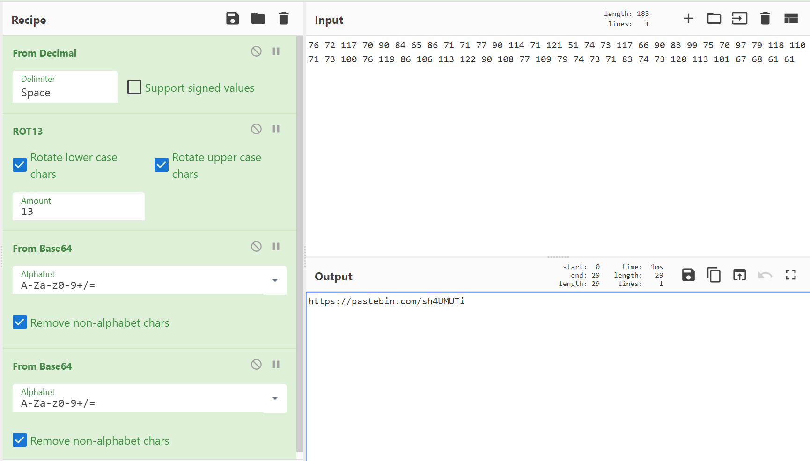

## Enunciado
Se nos aporta la siguiente cadena de valores decimales:
`76 72 117 70 90 84 65 86 71 71 77 90 114 71 121 51 74 73 117 66 90 83 99 75 70 97 79 118 110 71 73 100 76 119 86 106 113 122 90 108 77 109 79 74 73 71 83 74 73 120 113 101 67 68 61 61`

Aportando ademas la pista siguiente: Veni, vidi, vici along the way.

## Solucion
En primer lugar podemos deducir que en base a la pista que nos han dado se trata de algun tipo de cifrado que implica el de tipo Cesar.

Lo mas logico es tratar de pasar los numeros decimales a ascii para ver que nos muestran.
`LHuFZTAVGGMZrGy3JIuBZScKFaOvnGIdLwVjqzZlMmOJIGSJIxqeCD==`

Como podemos ver obtenemos un supuesto base64 que si tratamos de decodificarlo no nos aporta caracteres imprimibles que nos interesen. 

Pero si tenemos en cuenta la pista que se nos aporta podemos tratar de aplicarle un ROT13 al base64 y posteriormente decodificarlo obteniendo otro base64.
`aHR0cHM6Ly9wYXN0ZWJpbi5jb20vc2g0VU1VVGk=`

Y si lo decodificamos por ultima vez obtendremos un link a la web https://pastebin.com/sh4UMUTi

El conjunto de operaciones aplicadas anteriormente se puede ver en la siguiente imagen.

Por ultimo accederemos al enlace en el cual se muestra el siguiente texto correspondiente a un base32 recursivo.
`JJDEYRSRKIZFER2NLJLEOVCLI5FUURKFK5LVGTKKGVDVKS2WGJCESRJSIRDVGU2GJFFEWVKPKFNF
KTCKIFKTIVKTLBETKRSWKVGTEQ2KKZFEMUKVGJBEOSSDIUFEKVBSJ5DUURCVI5JUWRKJJJEFKTKN
KJKUUQSHIVKVCS2OJNNE4RKPKNNFKTCKIFKTEVKTKZFTIRSFGZGTEVKLIJBVKRKVGJEEUTSFKVEV
EQ2PI5LE2RKRKIZDECSKKJCUKNSWKNLEYQSDKVJVEQ2OJJLEGVSDKIZE4R2OINCUKVCKKVFTKQSV
INLVGVKKKZDVKTKWINMUWNBTIVMVKQ2HJNNE4RSPJZJFOSSKJBCTETSLGJETIM2EBJDU2MSWJNBE
WVBSKBFDKSCVGZKDEQ2RHUFA====`

Si resolvemos de manera recursiva dicho base32 obtemdremos la flag.

### flag{yo-soy-groot}
