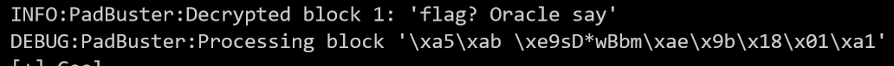

## Enunciado
Descifrar el siguiente mensaje del archivo "message.txt" generado con la librería criptográfica [crypto.py](./assets/crypto.py).

Puedes consultar al oráculo ([oracle.py](./assets/oracle.py)) en ctf.alphasec.eu:8001 si el mensaje es correcto ;)

## Solucion
A parte del los archivos proporcionados en el enunciado tambien se adjunta un fichero llamado [message.txt](./assets/message.txt) que contiene un texto cifrado el cual se intuye que deberemos descifrar.

Solo con el nombre del reto ya deducimos que se trata de un Oracle Padding Attack.

En este tipo de ataques se suele enviar un criptograma a un servidor / oraculo el cual nos responderá con un error en caso de que el padding sea erroneo o con exito en caso contrario, con dicha informacion y basandonos en que se usan cifrados en bloque tipo CBC que utilizan el bloque anterior para cifrar el siguiente y de manera analoga para descifrar podremos modificar los bloques para deducir el contenido descifrado de los siguientes a este y por consiguiente descifrar el criptograma por completo.

Este [repositorio](https://github.com/mpgn/Padding-oracle-attack) de github explica de manera muy buena en que consiste el Oracle Padding Attack, repositorio del cual aprendi la primera vez que ejecute este ataque en otro reto.

Para poder ejecutar de manera correcta este ataque primero deberemos conocer que errores lanza nuestro oraculo en caso de mandar un criptograma erroneo.

Como se nos adjunta el codigo podemos ver que en caso de no ser el criptograma indicado ya sea porque no cumple con un formato correcto o que el padding no es correcto nos devolvera la excepcion `BadPaddingException` o `Python exception` por lo que teniendo este aspecto en cuenta y reutilizando un script que podemos encontrar en este [repositorio](https://github.com/mwielgoszewski/python-paddingoracle) podremos llegar a crackear el criptograma.

El codigo hace uso de una libreria de python llamada [paddingoracle](https://pypi.org/project/paddingoracle/) para ir generando los criptogramas modificados y permite la definicion de una funcion llamada oracle que es la que se encarga de determinar si el oraculo ha validado correctamente o no el criptograma, y en base a eso se ira obteniendo poco a poco los caracteres del texto en claro.

### Codigo del script
```from paddingoracle import BadPaddingException, PaddingOracle
from base64 import b64encode, b64decode
from urllib import quote, unquote
import requests
import socket
import time

class PadBuster(PaddingOracle):
    def __init__(self, **kwargs):
        super(PadBuster, self).__init__(**kwargs)

    def oracle(self, data, **kwargs):
        while 1:
            try:
                s = socket.socket(socket.AF_INET, socket.SOCK_STREAM)
                s.connect(("ctf.alphasec.eu",8001))
                s.recv(0x14)
                s.send(b64encode(data) + "\n")
                r = s.recv(1000).decode('utf-8')
                s.close()
                break
            except Exception as e:
                print "[!] Socket error, retrying"
                continue
        if 'BadPaddingException' in r or 'Python exception' in r:
            raise BadPaddingException
        else:
            print "[+] Cool"
            return

        

if __name__ == '__main__':
    import logging
    import sys

    logging.basicConfig(level=logging.DEBUG)

    encrypted_cookie = '/9DU7U/XgCHqS3smDqFJiLjpWDkgbQGoMUq7VdwECY/br5wDHxiuOfxPh39fsUXdpasg6XNEKndCYm2umxgBodsGpDIX96RuyTPOH1uuQeW1jivzOaJIX1OFko6LAgN0vttuRU2ijIQgDZBHXrBJ+cnkgdE0TUJcrJGSfZ0ZCr/WH/RmJCiyqmmnMrzvQ/aW'

    padbuster = PadBuster()

    cookie_decrypted = padbuster.decrypt(b64decode(encrypted_cookie), block_size=16)

    print('Decrypted somecookie: %s => %r' % (sys.argv[1], cookie_decrypted))
```
 Finalmente si ejecutamos este script obtendremos la flag poco a poco ya que se iran obteniendo los bloques de uno en uno.
 
 
 
 
 

 ### flag{padding_oracle_cbc}


