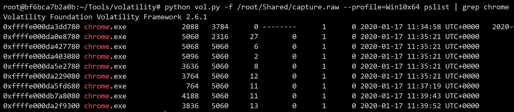
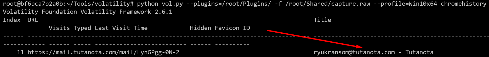
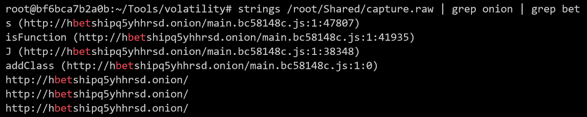
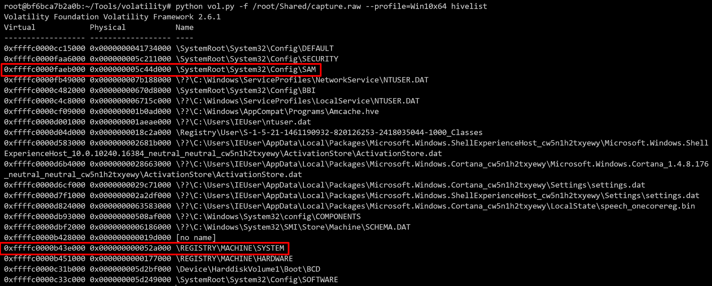
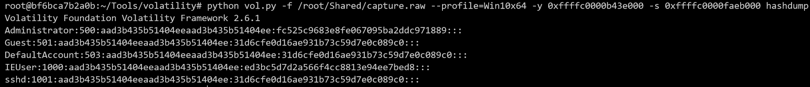
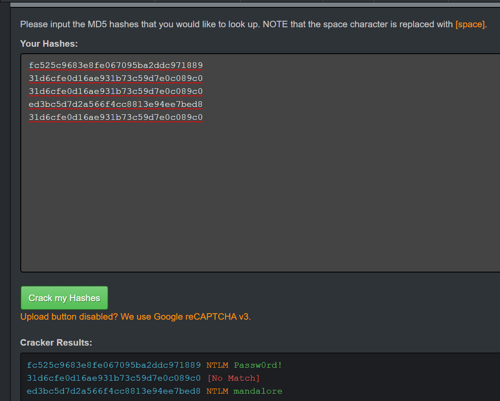

# Introduccion
Dado que todos los retos forenses se efectuan sobre el mismo dump de memoria todos los retos estaran contenidos en este documento.
La imagen se puede encontrar en https://mega.nz/#!HB1m0CJJ!NsmOEvBDvDMlh0-DiLSyyNF1xr11PUPH4bwQOJS9hJ4
(Si el link se cae notificadmelo para resubirlo)

## ¿Servicio de correo?
Nos ha llegado una captura de ram de un sospechoso.
Parece ser que no utiliza un correo normal como Gmail.

## Solucion
Como la mayoria de retos de forense en los que se nos adjunta un dump de memoria utilizaremos la herramienta [volatility](https://github.com/volatilityfoundation/volatility) para analizar el adjunto.

En primer lugar podemos ver mediante el comando pslist los distintos procesos que estaban abiertos justo en el momento del dumpeo.
`python vol.py -f /root/Shared/capture.raw --profile=Win10x64 pslist`

En el output nos llama la atencion que chrome este funcionando ya que de este se podrian extraer paginas visitadas, etc.

Para proceder a la extraccion de informacion de chrome usaremos un script de un [repositorio](https://github.com/superponible/volatility-plugins) publico de github.

Y mediante el siguiente comando obtendremos el servicio de correo electronico.

Consiguiendo asi la primera flag.

### flag{tutanota}

## Direccion de correo
Vaya servicio de correo mas raro... ¿Pero que dirección de correo usa?

## Solucion
En la explicacion del reto anterior en la misma captura en la que se muestra el servicio de correo se puede ver su correo personal.

### flag{ryukransom@tutanota.com}

## Darknet
Parece que le ha dado por usar cosas raras a este usuario. Estaba en algún tema de apuestas con una dirección rara. ¿Sabrías decirme cual es?

## Solucion
Para resolver este reto se usara un metodo quizas poco sutil pero efectivo y consistira basicamente en hacer un strings al dump de memoria y fildra por .onion ya que se trata de la DarkNet. Como parametro adicional ya sabiendo el resultado se filtrara tambien por bet que significa apuesta en ingles.
`strings /root/Shared/capture.raw | grep onion | grep bet`

Obteniendo asi la flag.

### flag{hbetshipq5yhhrsd.onion}

## Clave del usario
¿Sabrias decirme la clave de la cuenta de windows?

## Solucion
Para resolver este reto trataremos de extraer los hashes NTLM correspondientes a las clave de los usuarios locales del host dumpeado.

Para realizar esto volatility nos permite extraer las direcciones virtuales de los registros cargados en RAM para posteriormente con dichas direcciones extraer los hashes.

En primer lugar extraeremos las direcciones virtuales.
`python vol.py -f /root/Shared/capture.raw --profile=Win10x64 hivelist`

Estan marcadas las direcciones que nos interesan.

Una vez tenemos las direcciones procederemos a obtener los hashes.
`python vol.py -f /root/Shared/capture.raw --profile=Win10x64 -y 0xffffc0000b43e000 -s 0xffffc0000faeb000 hashdump`

Por ultimo para crackear los hashes antes de intentar usar una herramienta local con un diccionario comun como rockyou probaremos a usar bases de datos online que contienen muchisimas claves asociadas a hashes guardados.

En este caso usaremos la web [hashkiller](https://hashkiller.co.uk/Cracker/MD5) a traves de la cual obtendremos algunas de las claves y una de ellas sera la flag.

### flag{mandalore}