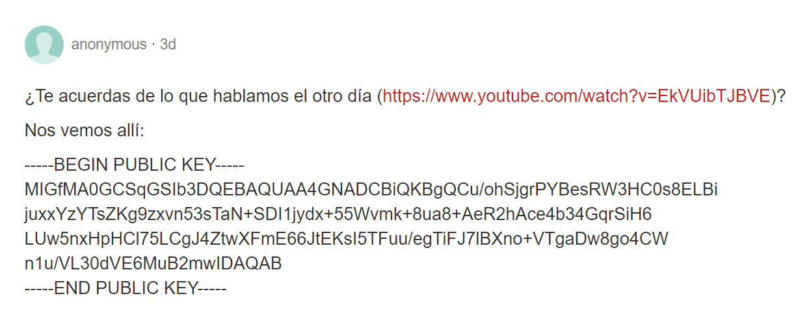
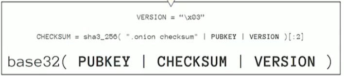
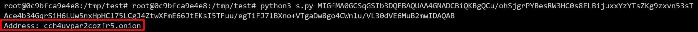
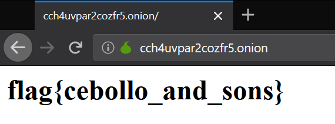

## Enunciado
Hemos detectado un paste muy sospechoso en la siguiente dirección: https://justpaste.it/4doeo
¿Qué significará?

## Solucion
En primer lugar procederemos a ir al enlace que se nos adjunta ya que hasta el momento es la unica via a usar.


Aqui podemos ver un enlace a un video de youtube y una clave de tipo rsa publica.

Si nos miramos el video el cual pertenece a una charla sobre DarkWeb y servicios de la DarkNet podemos ver que hay un momento en el cual se nos explica como podemos calcular una direccion de Tor (.onion) a partir de una clave publica.


Esta formula sumada a una busqueda adicional en internet nos lleva a conocer como calcular dicha direccion .onion.

A continuacion se muestra un pequeño script en python mediante el cual se ha podido calcular dicha direccion.
```
from base64 import b32encode,b64decode
from hashlib import sha1
from sys import argv,exit

def main():
    if len(argv) != 2:
        print("Usage: python3 s.py <BASE64>")
        exit(1)
    print("Address: " + b32encode(sha1(b64decode(argv[1])[22:]).digest()[:10])[:16].decode().lower() + ".onion")

if __name__ == "__main__":
    main()
```

Usando dicho script elaborado en poco tiempo podemos obtener la direccion .onion ejecutando el siguiente comando.
`python3 s.py MIGfMA0GCSqGSIb3DQEBAQUAA4GNADCBiQKBgQCu/ohSjgrPYBesRW3HC0s8ELBijuxxYzYTsZKg9zxvn53sTAce4b34GqrSiH6LUw5nxHpHCl75LCgJ4ZtwXFmE66JtEKsI5TFuu/egTiFJ7lBXno+VTgaDw8go4CWn1u/VL30dVE6MuB2mwIDAQAB`


Address: `cch4uvpar2cozfr5.onion`

Por ultimo si accedemos a dicha direccion obtendremos la ansiada flag.


### flag{cebollo_and_sons}
