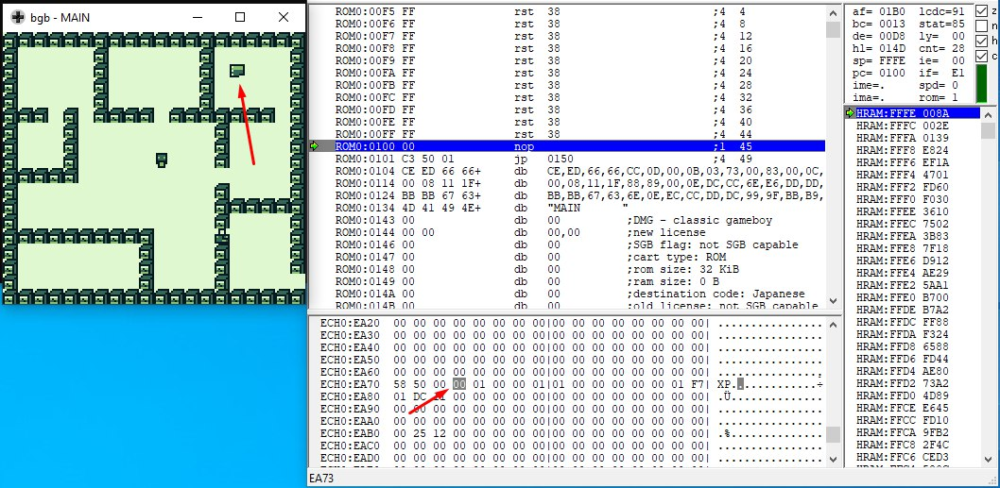
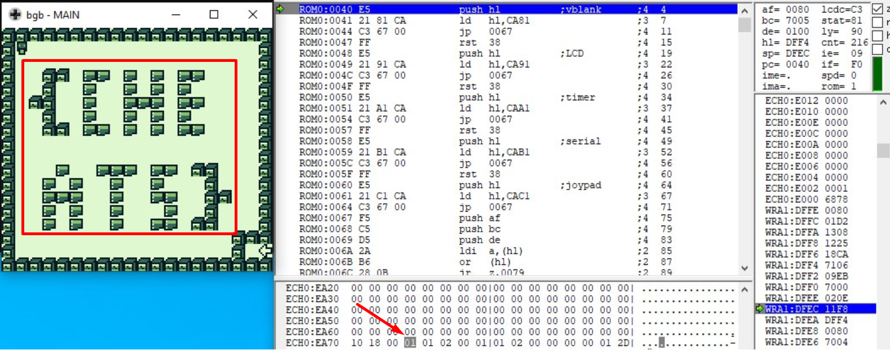
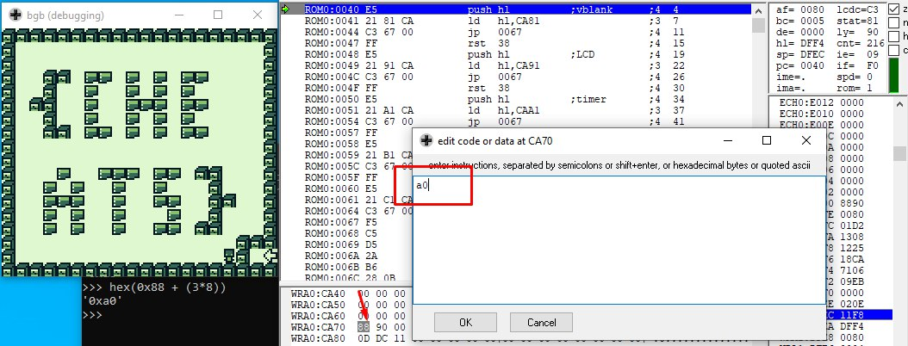
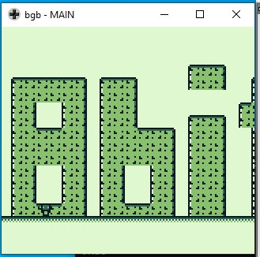

# Introduccion
Dado que los dos retos de reversing se efectuan sobre el mismo binario ambos estaran contenidos en este documento.
El binario que se trata de un juego de Game Boy es [hackerman.gb](./assets/hackerman.gb)

## Game Master
Solo los mejores sabes jugar a los juegos clásicos como yo!!

## Solucion
Lo primero es comentar que este reto ha sido algo divertido ya que habia reverseado videojuegos antes pero nunca de una Game Boy por lo que ha sido nuevo conocimiento adquirido.

Por consiguiente tuve que investigar sobre CTFs antiguos de este tema y conclui con que la herramienta ideal iba a ser [bgb](http://bgb.bircd.org/)

Esta herramienta nos permite arrancar el juego y abrir un debugger para poder ir viendo como cambia la memoria y asi descubrir donde se guardan los parametros del juego como posicion, etc.

Analizando la seccion de la memoria podemos ver que hay un valor que se incrementa cuando cogemos la primera llave y se decrementa al usarla, por lo que tras pasar la primera puerta se decrementara pero si luego la ponemos a uno podremos llegar a la primera flag.

### flag{cheats}

## Game Master (part2)
Si eres bueno llegas al final...

## Solucion
Para esta parte que tenemos por asi decirlo que teletransportarnos a la flecha buscaremos la direccion de memoria en la que se guarde la posicion del jugador y la editaremos con la posicion de la flecha para aparecer ahi y acabar el nivel.

Y asi acabamos pasando el nivel y obteniendo la segunda flag.

### flag{8bit}